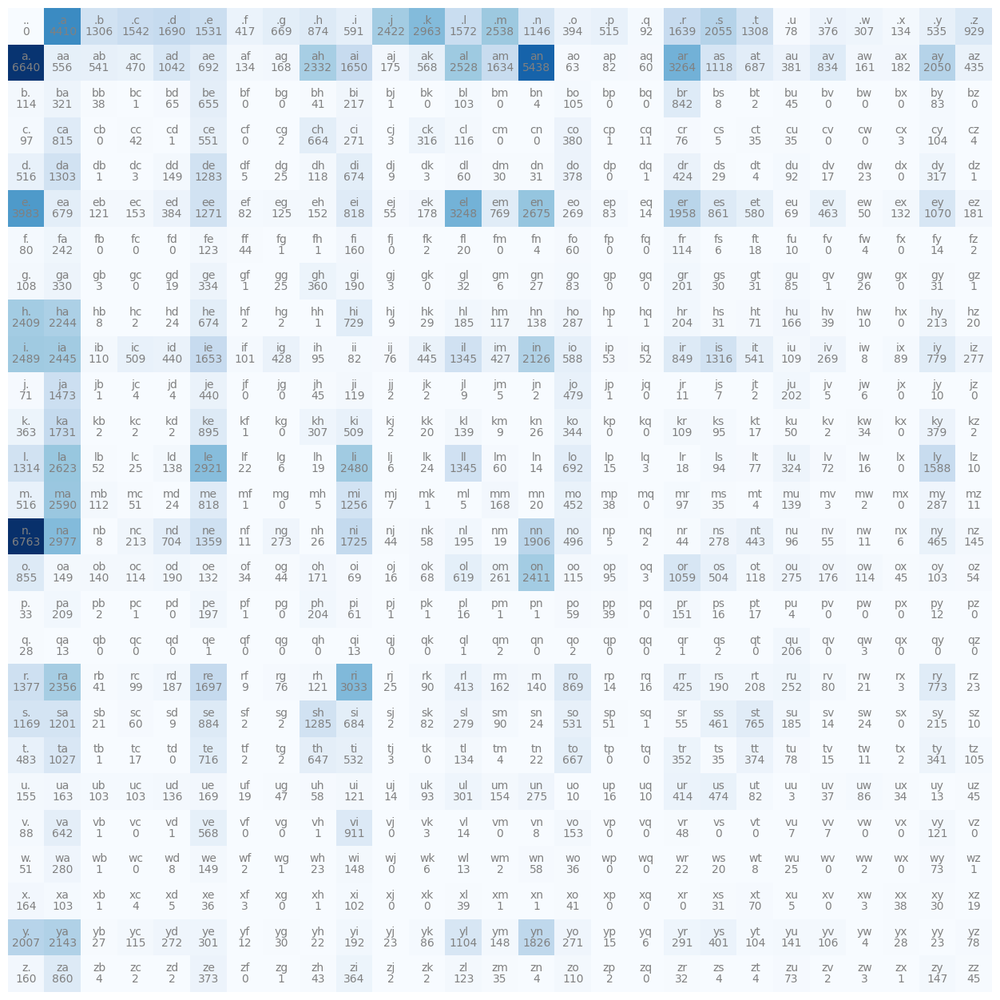

# 🚀 Translations to Tokens: Deep Learning & Sequence Engines from Scratch

[](https://github.com/Manohar-07-git)
[](https://pytorch.org/)
[](https://jupyter.org/)
[](https://opensource.org/licenses/MIT)

A comprehensive, production-grade repository tracing the evolution of sequence modeling. This project documents the process of building state-of-the-art architectures **entirely from scratch** using PyTorch. Progressing from low-level automatic differentiation engines to building a full **Encoder-Decoder Transformer Translation Machine** trained on real-world datasets, this repo serves as a testament to deep, foundational AI engineering.

---

## 🏗️ Core Engineering Highlights

*   **Custom Tokenizer:** Built a fully operational Byte Pair Encoding (BPE) tokenizer from the ground up, mimicking OpenAI's `tiktoken` architecture.
*   **74-Param Translation Model:** Formulated and trained an Encoder-Decoder Transformer from scratch on the OPUS Books dataset, achieving a highly converged validation loss.
*   **Engine-Level Micrograd:** Implemented a custom scalar-valued autograd engine with dynamically generated computational graphs using Graphviz.

---

## 📅 Project Workflow & Timeline

### 🔹 Week 1: Foundations & The Bigram Model

#### Lecture 1: Micrograd from Scratch
*   Built a custom **micrograd** automatic differentiation engine entirely from scratch.
*   Visualized computation graphs dynamically using `Graphviz` (`Digraph`).
*   Designed intuitive, low-level object-oriented implementations for neural network components by building custom `Neuron`, `Layer`, and `MLP` classes.

<p align="center">
  
</p>

#### Lecture 2: Character-Level Bigram Language Model
1.  **The Counting Method:** Processed a text dataset to count character-to-character transitions (bigrams). Implemented standard string-to-integer (`stoi`) and integer-to-string (`itos`) mapping functions to construct a clean frequency lookup matrix.
    
    <p align="center">
      
    </p>

2.  **The Neural Network Method:** Built a single-layer neural network proxy for the bigram model. 
    *   Formulated the dataset pipeline using **One-Hot Encoding**.
    *   Initialized random weights and biases.
    *   Hand-wrote the cross-entropy loss function ($Matrix\ Multiplication \rightarrow Exponentiation \rightarrow Softmax\ Probabilities$ using PyTorch broadcasting).
    *   Optimized parameters using manual gradient descent.

---

### 🔹 Week 2: Embeddings, Initialization & Normalization

#### Lecture 3: MLP & Character Embeddings
*   Implemented a Multi-Layer Perceptron based on the seminal [Bengio et al. 2003 Neural Language Model Paper](https://www.jmlr.org/papers/volume3/bengio03a/bengio03a.pdf).
*   Developed distributed **Character Embeddings**. Projecting tokens into a dense continuous space allows the network to automatically cluster semantic similarities (e.g., teaching the model that `'A'` and `'The'` share similar syntactic profiles).
*   Studied techniques for diagnosing and choosing an optimal **Learning Rate (LR)**.

<p align="center">
  
</p>

#### Lecture 4: Activations & Deep Network Dynamics
*   Explored deep-network stabilization inspired by the [Kaiming He et al. Paper](https://arxiv.org/pdf/1502.01852) and the [Batch Normalization Paper](https://arxiv.org/pdf/1502.03167).
*   **The Math Behind Kaiming Init:** Xavier initialization fails with ReLU because negative values get zeroed out ($f(x) = \max(0, x)$), cutting variance in half at every layer and leading to vanishing signals. Kaiming stabilizes deep networks by dynamically scaling weights using the input dimensionality (`fan_in`):
  
  $$\sigma = \sqrt{\frac{2}{\text{fan\_in}}}$$

#### 📝 Core Assignments Completed:
*   Trained a model on the **MNIST Handwritten Digit Dataset**.
*   Practiced **Layer Folding** techniques post-training for inference optimization.
*   Systematically reduced validation loss baselines established in previous lectures.

---

### 🔹 Week 3: Framework Internals & WaveNet Architectures

#### Framework Familiarity (PyTorch Scratchpad)
*   Developed custom, manual implementations of standard PyTorch structural components including `BatchNorm1d` and `Linear` layers to understand under-the-hood tensor manipulations.

#### Lecture 5: Manual Backpropagation Mastery
*   Deep-dive into writing raw backpropagation algorithms by hand (recreating the classic 2012–2015 production pipeline workflow). Moved from basic chain-rule derivations to professional-level gradient tracking across multi-layer graph structures.

#### Lecture 6: Hierarchical Sequence Models (WaveNet Style)
*   Implemented a dilated, tree-like sequence structure inspired by DeepMind's [WaveNet Architecture Paper](https://arxiv.org/pdf/1609.03499).
*   Instead of squeezing an entire mini-batch context length flat immediately, the model groups consecutive byte/token pairs hierarchically across progressive layers, dramatically optimizing context efficiency and improving downstream loss metrics.

---

### 🔹 Week 4: Recurrent Architectures, Tokenization & Applied Sequences

#### RNN & LSTM Deep-Dive
*   Wrote comprehensive, foundational research notes analyzing the mechanics of Recurrent Neural Networks (RNNs) and Long Short-Term Memory (LSTM) networks. 
*   Addressed the classic vanishing and exploding gradient problems inherent in vanilla RNNs, detailing how the LSTM cell mitigates this using an internal cell state ($C_t$) regulated by three unique gating mechanisms:
    *   **Forget Gate ($f_t$):** Controls how much of the past cell state to discard.
    *   **Input Gate ($i_t$):** Decides which new information to store in the cell state.
    *   **Output Gate ($o_t$):** Determines the next hidden state ($h_t$) based on the updated cell state.

#### Bigram Language Model (LSTM Variant)
*   Adapted the character-level Bigram framework from Week 1 into a recurrent paradigm using a custom LSTM wrapper (following the architectural workflow outlined in Andrej Karpathy's sequence modeling series). 
*   Replaced the linear proxy network with a recurrent transition pipeline to track temporal dependencies across character tokens.

#### Custom Tokenization Pipeline
*   Implemented a custom Byte Pair Encoding (BPE) tokenizer from scratch, mirroring the core architectural design of OpenAI’s `tiktoken`.
*   Developed the iterative token-merging loops, regex-based boundary splitting, and vocabulary construction algorithms necessary to process raw text into dense, sub-word token sequences.

#### Semantic Exploration & Doubt Clarifications
*   Compiled targeted research notebooks addressing common edge cases and advanced concepts in representation learning, specifically focusing on the mathematical mechanics of **Word Embeddings** and dense geometric projections.

#### 📝 Applied Capstone: Emoji Predictor
*   Constructed an interactive sequence model using the self-implemented LSTM layer. The network processes input text strings, tracks semantic context, and dynamically predicts the most contextually relevant emoji.

---
---

## 🏛️ Pre-Transformer Baseline: Traditional Seq2Seq (Self-Study)

Before diving into modern attention-based systems, I independently implemented a classic **Recurrent Encoder-Decoder (Seq2Seq)** framework using vanilla LSTMs/GRUs. This served as my baseline control environment to understand the historical evolution of Machine Translation.

### ⚠️ The Information Bottleneck & Degradation Limits
While highly effective for short phrases, this implementation clearly exposed the classic architectural vulnerability of pre-attention NLP:
* **The Context Vector Squeeze:** The model forces variable-length input sequences to compress entirely into a single, fixed-length hidden state vector ($h_T$). 
* **Long-Sentence Degradation:** For longer inputs, the network suffers from severe information loss and recency bias, causing generation to fall apart as sentence complexity scales.

> **Key Engineering Takeaway:** Building this traditional model was a deliberate design choice. Directly experiencing this compression bottleneck provided the exact structural intuition needed to appreciate why **Transformers and Self-Attention** were required to scale modern LLMs.

---
### 🔹 Week 5: Attention Mechanisms & Full‑Scale Machine Translation

#### Lecture 7 & 8: Generative Pre-trained Transformers (GPT)
*   Implemented a decoder-only Transformer model modeled after Karpathy's final language modeling lectures.
*   Hand-coded the core building blocks of modern LLMs, including **Causal Self-Attention** (using a lower-triangular causal mask matrix to block future tokens), Multi-Head Attention, Layer Normalization, and Residual Connections.

#### Encoder‑Decoder Translation Architecture
*   Authored a detailed, end-to-end explanatory notebook walking through the mathematical and structural differences of a full Encoder-Decoder Transformer framework.
*   Documented how the encoder maps the source sequence into a continuous representation, which the decoder then queries via **Cross-Attention mechanisms** to generate target sequences step-by-step.

#### 🏗️ Interactive Translation Engine (`engine.py`)
*   Developed `engine.py`, a clean, modular runtime file hosting the core operational loops for an interactive translation pipeline.

| Metric | Target Value |
| :--- | :--- |
| **Model Size** | 73.6M Parameters |
| **Dataset** | OPUS Books (English to French) |
| **Training Loss** | `1.4` |
| **Validation Loss** | `1.5` |

---

## 🚀 Getting Started & Quickstart

### Installation
```bash
git clone [https://github.com/Manohar-07-git/Translations-to-Tokens.git](https://github.com/Manohar-07-git/Translations-to-Tokens.git)
cd Translations-to-Tokens
pip install -r requirements.txt
